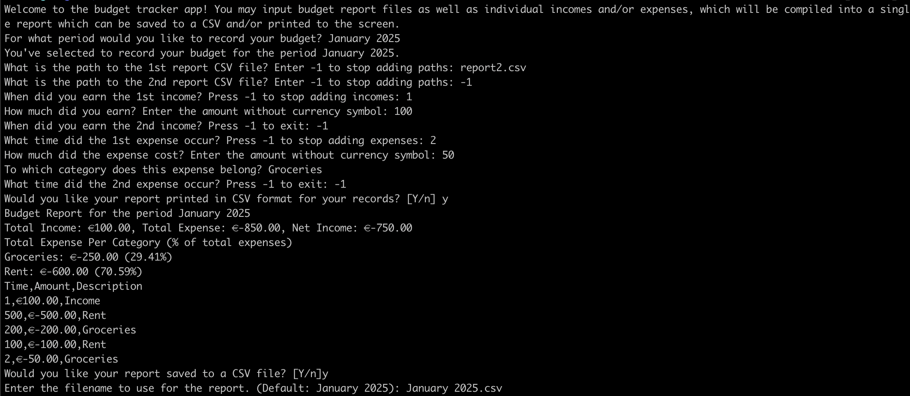

[](https://pkg.go.dev/github.com/kevslinger/budget)
[](https://goreportcard.com/report/github.com/kevslinger/budget)

# Budget Tracker App

`budget` helps you track your incomes and expenses.
By submintting them via the command line, you can receive a report of your budget in CSV format.

## Installation and Running

To install: 

```shell
go install github.com/kevslinger/budget/cmd/budget@latest
```

To run:

```shell
budget
```

## Example

